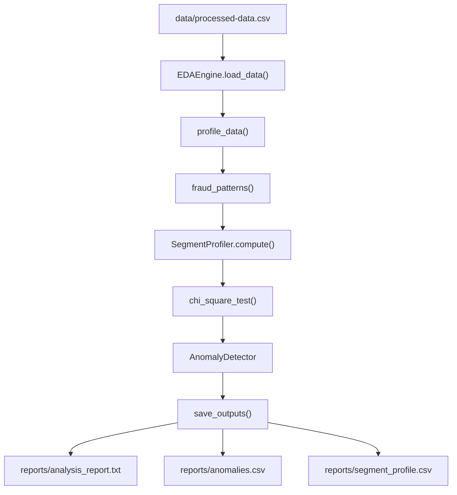
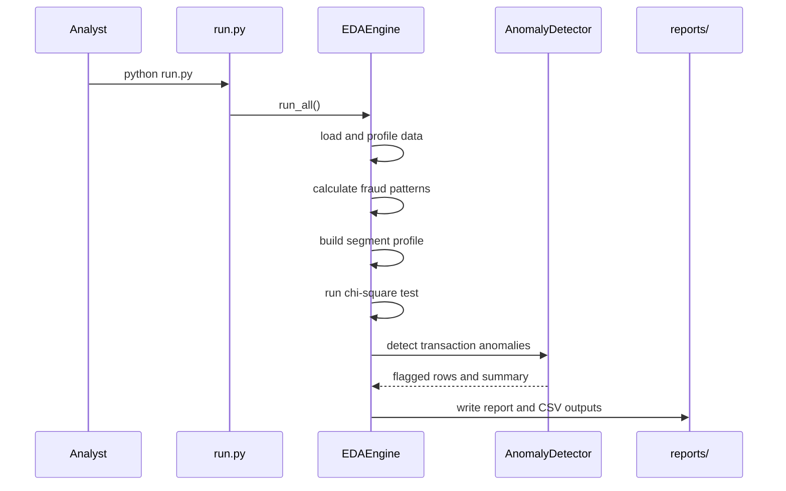

# Banking EDA

Banking EDA is a Python exploratory data analysis project for NexBank's risk analytics team. It analyzes processed transaction data to find fraud concentration patterns, profile customer segments, test whether fraud is statistically associated with merchant category, and flag suspicious transaction anomalies.

## Business Context

NexBank needs evidence that fraudulent transactions cluster in specific business dimensions such as merchant category, channel, time period, or customer segment. The project turns `data/processed-data.csv` from the Module 05 ETL pipeline into analyst-ready outputs in `reports/`.

## Key Questions

- Where do fraudulent transactions concentrate by merchant category, channel, transaction hour, transaction month, and segment?
- How do Retail, Premium, Business, and Student segments differ by transaction value, frequency, and fraud rate?
- Is fraud independent of `merchant_category`, or is the relationship statistically significant?
- Which records are unusual by transaction amount, and which fraud records look normal by amount?

## Architecture



## Project Structure

```text
banking-eda/
├── config.py
├── run.py
├── requirements.txt
├── notebooks/
│   └── 01_eda_exploration.ipynb
├── setup/
│   └── verify_connection.py
├── src/
│   ├── anomaly_detector.py
│   └── eda_engine.py
└── test/
    └── test_eda.py
```

## Main Components

| Component | Purpose |
|---|---|
| `run.py` | Entry point that runs the complete EDA workflow. |
| `config.py` | Central paths, thresholds, report locations, and logging setup. |
| `src/eda_engine.py` | Loads data, profiles transactions, calculates fraud patterns, runs chi-square testing, and writes outputs. |
| `SegmentProfiler` | Builds per-segment transaction, customer, value, and fraud-rate metrics. |
| `src/anomaly_detector.py` | Flags amount anomalies using IQR and Z-score consensus, plus fraud records with normal amounts. |
| `test/test_eda.py` | Project tests for the EDA and anomaly logic. |

## Analysis Workflow



## Inputs

The expected input is:

```text
data/processed-data.csv
```

This file should come from the Module 05 ETL pipeline and should already contain cleaned, typed, transaction-level banking records. Important columns include:

- `transaction_id`
- `customer_id`
- `segment`
- `is_fraud`
- `merchant_category`
- `channel`
- `transaction_value` or `amount`
- `transaction_time`, `transaction_date`, or derived time fields

## Outputs

| Output | Description |
|---|---|
| `reports/analysis_report.txt` | Human-readable summary of profile metrics, fraud patterns, chi-square results, anomaly counts, and segment profile. |
| `reports/anomalies.csv` | Records flagged by amount anomaly, fraud-with-normal-amount, or suspicious-amount-not-marked-fraud rules. |
| `reports/segment_profile.csv` | Segment-level statistics including transaction counts, customer counts, total amount, average amount, fraud count, and fraud rate. |

## Setup

1. Create and activate a virtual environment.
2. Install dependencies:

```powershell
pip install -r requirements.txt
```

3. Add the processed input file:

```text
data/processed-data.csv
```

## Usage

Run the full pipeline from the project root:

```powershell
python run.py
```

The console prints high-level completion metrics, while detailed results are saved in `reports/`.

## Testing

Run the project tests from the repository root:

```powershell
python -m pytest test
```

If `pytest` is not installed, install it first:

```powershell
pip install pytest
```

## Statistical Methods

| Method | Use |
|---|---|
| Grouped aggregation | Finds fraud concentration by business dimension. |
| Segment profiling | Compares behavior across customer segments. |
| Chi-square independence test | Tests whether `merchant_category` and `is_fraud` are statistically independent. |
| IQR outlier detection | Flags amount values outside `Q1 - 1.5 * IQR` and `Q3 + 1.5 * IQR`. |
| Z-score outlier detection | Flags values more than 3 standard deviations from the mean. |
| Consensus anomaly rule | Treats amount anomalies as stronger when both IQR and Z-score agree. |

## License

This project is licensed under the MIT License. See `LICENSE` for details.
